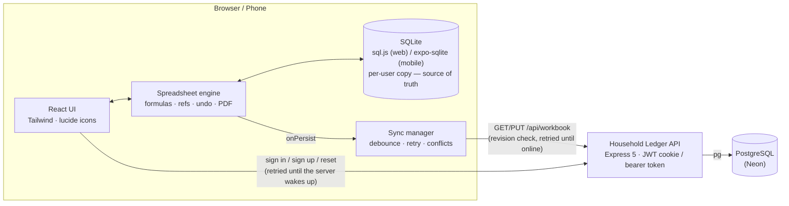
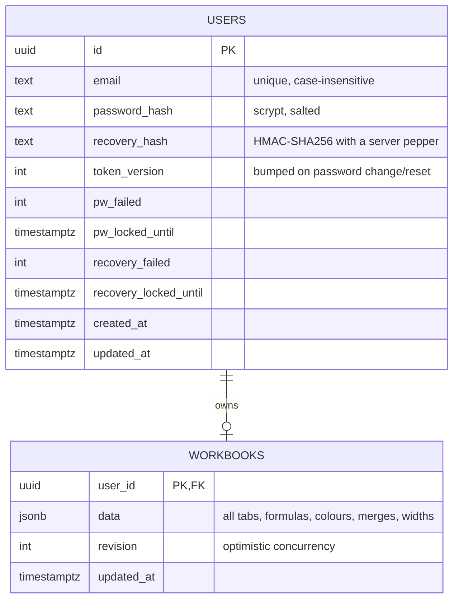

<div align="center">

# 📒 Household Ledger

**A Mini Excel for Your Household Bills**

A full-stack spreadsheet for tracking bills, meter readings and monthly budgets — with real formulas, multiple tabs, colour-coded cells, PDF export, user accounts, and a Neon Postgres database that keeps your ledger in sync across your phone and computer.

[](src)
[](vite.config.ts)
[](src/index.css)
[](server)
[](#-database)
[](#-testing)
[](#-license)

</div>

---

## 🔗 Live Demo

| | Link |
|---|---|
| 🌐 Website | *Not deployed yet* — see [Deployment](#-deployment) (one-click Render Blueprint included) |
| 💓 API health check | *Not deployed yet* — `GET /api/health` |
| 📘 In-app Guide | Menu → **Guide** (formulas and every tool, explained for beginners) |

## 📖 Overview

Household Ledger is a small, fast spreadsheet built for everyday money tracking — an electricity bill that multiplies units by a rate, a monthly budget with a `SUM` total, a summary tab that pulls numbers from other tabs. Everything lives in your account, so the same ledger opens on your phone and on your PC, and keeps working when the connection drops. One server, one database:

- **Web app** (`src/`) — a responsive React spreadsheet designed phone-first, with a proper desktop layout too.
- **API** (`server/`) — a single Express service that handles accounts and stores each ledger.
- **Database** — Neon (Postgres). In development it uses a real Postgres running inside the Node process, so you need no account to try it.

## ✨ Features

**Spreadsheet & formulas**
- 🧮 A real formula engine — `+ - * /`, brackets, cell references, **ranges**, and the functions `SUM`, `AVG`/`AVERAGE`, `MIN`, `MAX`
- 📑 **Multiple tabs** (up to 40) with cross-tab references like `=Tab1!B6` or `='My Bills'!B6` — rename a tab and every formula follows; delete one and dependants show `#REF!`
- 📌 Relative and **absolute references** (`$B$1`, `$B1`, `B$1`) that behave correctly when copied
- 📋 **Copy / paste** that moves formulas with the block, repeats a block to fill a bigger selection, supports **fill down** (`Ctrl+D`), and accepts tab-separated text from Excel or Google Sheets
- ➕ Insert / delete rows and columns — formulas, ranges, merges and other tabs' references are all rewritten automatically
- 🔀 Merge / unmerge cells, resizable columns (works with a finger too)
- ↩️ **Undo / redo** — up to 100 steps, across tabs, structure changes and backups
- ⚠️ Familiar error codes: `#DIV/0!` `#VALUE!` `#REF!` `#NAME?` `#CIRC!` `#ERR!` `#NUM!`
- 🧱 Ready-made blocks — **Meter reading** (usage × rate) and **Monthly budget** — plus a *Load example* button

**Formatting**
- 🎨 **8 fill colours with an opacity slider** (10–100%) — coloured cells always keep a clear border, at any opacity and on any theme
- 🅱️ Bold, number formatting with thousands separators, right-aligned numbers, and a marker on formula cells

**Menu, files & export**
- 🗂️ A grouped **Menu** — Save backup · Open backup · PDF this tab · PDF all tabs · Insert block · Load example · New tab · Rename · Copy tab · Delete tab (two-step confirm) · Clear tab
- 💾 **Backup files** (JSON, every tab, formulas, colours and layout) — also open by drag-and-drop; backups from the original single-file version still open
- 📄 **PDF export** drawn on a canvas (no PDF library) — wide tabs turn landscape or split across pages; colours and merged cells print as they look
- 🎯 Icon-only toolbar — Undo · Redo · Copy · Paste · Select range · Bold · Fill · Cells (merge / rows / columns)
- 📘 A 16-section in-app **Guide**: formulas, functions, `$` references, tabs, error codes, shortcuts, and worked examples

**Look & feel**
- 🌗 **8 colour themes** (Teal, Ocean, Violet, Rose, Copper, Forest, Slate, Mono), each in **Light / Dark / Auto**
- 📱 **Built for small phones** — fits a 320px screen with no sideways scroll, big touch targets, tap once to select and again to edit, a **Select range** mode, and a keyboard mode that shows only the grid and formula bar with a **Done** button and symbol keys (`( ) , : + - × ÷`)

**Accounts & security**
- 🔐 Sign up / sign in with **JWT** sessions kept in an **HttpOnly, SameSite=Strict** cookie (page scripts can never read the token)
- 🔑 **6-digit recovery code** shown once at sign-up. Forgot your password? Email + code + new password → password changes, other devices are signed out, and you are given a **brand-new code** (the old one dies)
- 🛡️ Salted **scrypt** password hashes, recovery codes stored as a peppered HMAC, lockouts after repeated wrong guesses, per-IP rate limits, strict security headers

**Sync**
- ☁️ **Offline-first, backed by real SQLite** — every read and write goes through an on-device SQLite database (`sql.js` in the browser, `expo-sqlite` on mobile), not just a cache; the device's own copy is the source of truth, so the ledger opens instantly and works fully offline, online or not
- 🔄 Autosave about 1.5 s after you stop typing, queued and synced to the server automatically once you're back online, with growing-backoff retry and a live sync dot on the Account icon
- 🤝 **Conflict-safe** — every save is revision-checked, so a change made offline can never silently clobber one made elsewhere: if the ledger moved on another device, nothing is overwritten silently — you choose *Use the other version* or *Keep mine*
- 🐢 **Cold-start aware** — if the API host is asleep (a free-tier server waking up), the app retries the real request with backoff until it gets a genuine answer, instead of showing an error after one failed try
- 🧹 Per-user local storage and sign-out clean-up, so a shared browser never shows someone else's ledger
- 📴 **Installable PWA with a real offline app shell** — a service worker precaches the HTML/JS/CSS/fonts/SQLite-wasm, so the installed app opens (and keeps working) with zero connection, not just zero server; a new version is offered as a reload instead of forced mid-edit

## 🏗️ Architecture



**Why SQLite, not just localStorage/MMKV:** the workbook, sync queue, and cached session all live in
actual SQL tables (`src/storage/sqlite.ts` on web, `src/storage/sqlite.ts` in the mobile project) behind
the same synchronous key/value interface `Store`/`SyncManager` already expected — so the engine code
needed zero changes. On web, sql.js (SQLite compiled to WebAssembly) keeps the database in memory and
persists a serialized snapshot to IndexedDB (debounced, and flushed on tab hide/close). On mobile,
`expo-sqlite`'s synchronous API reads and writes a real on-device `.db` file directly. Either way, a
write always lands on-device first; `SyncManager` picks it up and pushes it to the server in the
background, with the existing revision-based optimistic concurrency preventing duplicate or clobbered
writes — there is no separate operation log to de-duplicate, because every sync sends the whole current
workbook keyed to the revision it was based on, so replaying the same push twice is a no-op.

## 🧰 Tech Stack

| | Frontend (`src/`) | Backend (`server/`) |
|---|---|---|
| Language | TypeScript | TypeScript (run with `tsx`) |
| Framework | React 19 + Vite 8 | Express 5 |
| Styling | Tailwind CSS 4 (design tokens, 8 palettes × light/dark) | — |
| Icons & fonts | `lucide-react`, Instrument Sans, Bricolage Grotesque (self-hosted) | — |
| Data | In-memory engine + on-device SQLite (`sql.js` + IndexedDB) | PostgreSQL (Neon) via `pg`; JSONB for ledgers |
| Dev database | — | PGlite (real Postgres inside Node, zero setup) |
| Auth | HttpOnly cookie (never touched by JS) | `jose` (JWT HS256) · Node `crypto` scrypt · HMAC-SHA256 |
| Validation | — | `zod` |
| Hardening | Strict CSP-friendly build (no inline scripts) | `helmet` · `express-rate-limit` |
| Tests | Vitest | Vitest against a real Postgres engine |

## 🧮 Formula Cheat Sheet

| You type | It means |
|---|---|
| `=B3-B2` | Units used = current reading − previous reading |
| `=B4*B5` | Amount due = units × rate |
| `=(B2+B3)/2` | Brackets work like school maths |
| `=SUM(B2:B5)` | Add a range · `AVG`, `MIN`, `MAX` work the same way |
| `=SUM(B2:B5, D2, 100)` | Mix ranges, cells and numbers |
| `=Tab1!B6+Tab2!B4` | Read cells from other tabs |
| `=B4*$E$1` | `$` keeps the rate cell fixed when you copy the formula |
| `row_sum` in U4 | Writes `=SUM(A4:T4)` — everything left of U4 on row 4 |
| `col_sum` in U4 | Writes `=SUM(U1:U3)` — everything above U4 in column U |

## 📂 Project Structure

```
Rent_Management_Excel_Lite/
├── server/                        # Express API
│   ├── index.ts                   # start-up: config, database, listen
│   ├── app.ts                     # routes: auth, recovery, workbook · helmet · rate limits
│   ├── security.ts                # scrypt, recovery-code HMAC, JWT
│   ├── db.ts                      # Neon/Postgres pool, dev database, schema
│   ├── config.ts                  # env-driven config (refuses weak secrets in production)
│   └── server.test.ts             # API tests on a real Postgres engine
│
├── src/                           # React web app
│   ├── auth/                      # sign in · sign up · reset · recovery code · API client · sync
│   ├── engine/                    # the spreadsheet: formula.ts, refs.ts, store.ts, model.ts, pdf.ts ...
│   ├── components/                # Grid, Toolbar, Menu, Account panel, Guide, Theme, formula bar ...
│   ├── hooks/                     # phone keyboard mode
│   ├── theme.ts                   # theme state (mode + palette)
│   └── index.css                  # Tailwind setup, theme tokens, grid styles
│
├── public/                        # favicon, web manifest, theme bootstrap script
├── household-ledger.html          # the original single-file version (kept, unchanged)
├── render.yaml                    # Render Blueprint (one-service deploy)
├── .env.example                   # environment template
└── vite.config.ts · tsconfig*.json
```

## 🔌 API Reference

| Method | Endpoint | Description |
|---|---|---|
| `POST` | `/api/auth/signup` | Create an account — returns the **6-digit recovery code once** and starts a session |
| `POST` | `/api/auth/signin` | Sign in with email + password |
| `POST` | `/api/auth/signout` | End the session |
| `GET` | `/api/auth/me` | The signed-in user |
| `POST` | `/api/auth/reset` | Email + recovery code + new password → new password, **new recovery code**, other sessions signed out |
| `POST` | `/api/auth/password` | Change password (needs the current one) |
| `POST` | `/api/auth/recovery-code` | Make a new recovery code (needs the password) |
| `GET` | `/api/workbook` | Your ledger: `{ data, revision, updatedAt }` |
| `PUT` | `/api/workbook` | Save the ledger with `{ baseRevision, data }`; `409` if it changed elsewhere, `force` to overwrite |
| `GET` | `/api/health` | Health check |

Sessions use an **HttpOnly cookie**, not an `Authorization` header. Every route except sign-up, sign-in, sign-out, reset and health needs it. The server re-validates and normalises everything you save (sizes, names, colours) instead of trusting the client.

## 💾 Database



Tables are created automatically on start-up. A ledger is stored as one JSON document:

```jsonc
{
  "cur": 0,                                   // the tab that was open
  "sheets": [{
    "name": "Tab1",
    "data": {
      "rows": 40, "cols": 8, "colW": [140, 118, ...],
      "merges": [{ "r0": 0, "c0": 0, "r1": 0, "c1": 1 }],
      "cells": { "3,1": { "v": "=B3-B2", "b": 1, "f": 3, "o": 40 } }
      //          row,col   value/formula  bold  fill colour  fill opacity %
    }
  }]
}
```

## 🚀 Getting Started

### Prerequisites

- [Node.js](https://nodejs.org/) 20.12+ (22 recommended)
- *Optional:* a free [Neon](https://neon.tech/) project — not needed to try the app locally

### 1. Run it (no database account needed)

```bash
npm install
npm run dev        # web app: http://localhost:5173  ·  API: http://localhost:3001
```

Without `DATABASE_URL` the API runs a real Postgres inside the Node process and keeps its files in `.data/dev-db` (the console says `DEVELOPMENT database`). To try it on your phone, open the **Network** URL Vite prints while on the same Wi-Fi.

### 2. Connect Neon

1. In Neon create a project → **Connect** → turn on **Connection pooling** → copy the connection string.
2. `copy .env.example .env` and fill it in (`npm run secrets` prints two random values for the secrets).
3. `npm run dev` again — the tables are created automatically.

<details>
<summary>Environment variables</summary>

| Variable | Description |
|---|---|
| `DATABASE_URL` | Neon (pooled) connection string. Required in production |
| `JWT_SECRET` | Signs login tokens. 32+ characters. Changing it only signs everyone out |
| `RECOVERY_PEPPER` | Protects the stored recovery codes. 32+ characters. **Never change it once people have accounts** |
| `PORT` | Port to listen on (default `3001`) |
| `SESSION_DAYS` | Login lifetime in days (default `7`) |
| `TRUST_PROXY` | Set to `1` behind a proxy/load balancer so rate limits see real visitor IPs |
| `COOKIE_SECURE` | Set to `false` only to try the production build over plain `http` on your own network |
| `PGLITE_DIR` | Dev database folder (default `.data/dev-db`; `memory` for a throwaway one) |
| `STATIC_DIR` | Folder of the built web app to serve (default `dist`) |
| `RATE_LIMIT` | Set to `off` to disable per-IP rate limits (tests only) |

In production the server refuses to start if `DATABASE_URL`, `JWT_SECRET` or `RECOVERY_PEPPER` is missing or too short.

</details>

### 3. Production build

```bash
npm run build      # type-checks, then builds the web app into dist/
npm start          # NODE_ENV=production — serves the API and the web app together
```

### Scripts

| Command | What it does |
|---|---|
| `npm run dev` | Web app + API with hot reload |
| `npm run build` | Type-check and build the web app |
| `npm start` | Production server |
| `npm test` | Run all 75 tests |
| `npm run typecheck` | Type-check the web app and the server |
| `npm run secrets` | Print fresh random values for `JWT_SECRET` and `RECOVERY_PEPPER` |

## 🚢 Deployment

It deploys as **one service** — the Node server also serves the built web app, so there is a single URL and the login cookie stays same-site.

**Render (free):** push the repo to GitHub → Render → **New → Blueprint** → pick it. [`render.yaml`](render.yaml) sets up the build, start command, health check and variables. Render asks for `DATABASE_URL` and `RECOVERY_PEPPER`, and generates `JWT_SECRET` itself. Serve over **https** (Render does this automatically). The free plan sleeps after ~15 minutes idle, so the first visit afterwards takes 30–60 s; the ledger keeps a copy on each device, so it still opens instantly.

Any other Node host (Railway, Fly.io, a VPS) works too — set the same variables and `TRUST_PROXY=1`.

## 🧪 Testing

```bash
npm test
```

| Suite | Tests | Covers |
|---|---|---|
| `src/engine/engine.test.ts` | 33 | formulas, references, insert/delete rows & columns, copy/paste, fill colour + opacity, merge, tabs, backups |
| `server/server.test.ts` | 25 | sign-up, sign-in, JWT cookie, recovery-code reset and rotation, lockouts, session invalidation, ledger save / conflict / sanitising — on a real Postgres engine |
| `src/auth/sync.test.ts` | 17 | what to open with, debounced saving, offline retry, conflicts, expired sessions |

## 🔐 Security Notes

| | |
|---|---|
| Passwords | Salted **scrypt** (OWASP-recommended cost) |
| Recovery codes | Only 1,000,000 possibilities, so they are stored as an **HMAC keyed with `RECOVERY_PEPPER`** (a leaked database alone can't crack them) and guarded online by lockouts |
| Lockouts | 5 wrong recovery codes → resets locked for 15 min (counted under a row lock, so parallel guesses can't race it). 10 wrong passwords → sign-in locked for 15 min |
| Sessions | JWT in an HttpOnly, SameSite=Strict, Secure cookie; a version number signs every device out on password change or reset |
| Enumeration | Wrong email and wrong password give the same answer (and comparable timing) |
| Headers | `helmet` (strict CSP, HSTS over https), per-IP rate limits |

Email is only a username — nothing is emailed or verified, because recovery uses the code. If someone loses **both** their password and their recovery code, the account can't be recovered.

## 🗺️ Roadmap

- [ ] Multiple named ledgers per account
- [ ] More functions (`IF`, `ROUND`, `COUNT`, …)
- [ ] Optional email delivery for recovery codes
- [ ] Account deletion and full data export
- [ ] Integration tests against a real Neon branch in CI

## 📄 License

No license has been published for this project yet — all rights reserved by the author. Reach out if you'd like to use or build on it.

---

<div align="center">

Built with ☕ and ⌨️ by **[Farhan](https://github.com/Farhan0140)**

</div>
